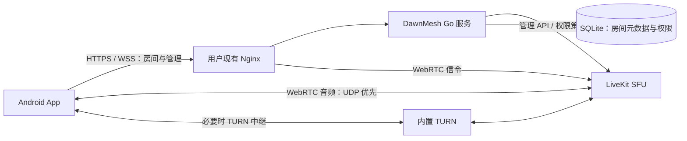

# 公网对讲模式设计与首版实现

日期：2026-09-13，2026-09-14 实现。状态：首版源码与部署材料已完成，自动化测试通过；25 人负载、复杂公网环境和多品牌蓝牙耳机仍需真机验收。

## 1. 产品范围与默认值

首页增加「网络对讲」，与 Wi-Fi、蓝牙并列。支持用户自部署服务器及服务器切换；房主是管理者，语音转发由服务器负责。近场模式仍可离线运行。

建议首版默认：

| 项目 | 默认行为 |
| --- | --- |
| 每房人数 | 25 人，包含房主；部署者可调整服务端上限 |
| 人数设置 | 房主可在服务器许可范围内设置，不在 App 写死 25 或旧版 6 人上限 |
| 发言模式 | 按住说话；每台手机可切换自动通话 |
| 同时发言 | 不以 25 人为同时开麦目标；默认允许多人发言，超过 4 路活跃语音时提示改用轮流对讲，不自动截断发言 |
| 音频 | WebRTC / Opus，单声道，目标 16 kbps，20 ms 音频包；按 SDK 实际协商结果记录日志 |
| 编码特性 | 优先使用 DTX、受限码率及可用的丢包恢复能力；开启效果和范围由选定 SDK 验证 |
| 权限 | 房主禁麦、解除禁麦、改房间名、移交房主、解散房间 |
| 房主最大断线时长 | 建房时设置整数 1–60 分钟，默认 10 分钟；到期后移交房主，不因此解散仍有成员在线的房间 |
| 普通成员恢复 | 意外断线保留身份和名额 10 分钟；主动离开立即释放 |
| 空房回收 | 最后一名在线成员意外断线后保留 10 分钟；无人恢复则解散 |
| 内容 | 语音和文字默认端到端加密，不录音，不落盘聊天 |
| 自部署 | 单机 Compose；Go 房间服务 + LiveKit 媒体服务；复用部署者现有 Nginx 卸载 TLS |

25 人是首版产品默认值，不是容量实测结论。大房间支持放宽人数，但要按「在线人数 × 活跃发言路数」验收。首版不提供视频、录音、账号系统、跨服务器漫游或集群管理后台。

## 2. App 交互

### 2.1 首页

```text
  Wi-Fi       蓝牙       网络对讲

  当前服务器  我的服务器                  ▾
  连接正常 · 支持加密语音

  [ 创建房间 ]
  服务器内的房间                       刷新
  户外小队              12 / 25 人       加入
  工作交流               4 / 25 人       加入
```

未配置时只显示「添加服务器」和简短说明；没有预置公共服务或硬编码业务域名。房间列表只来自当前服务器，不进行公网扫描；列表权限受服务器访问凭证约束。

### 2.2 服务器配置

添加服务器只要求：地址，例如 `https://talk.example.com`；名称自动读取，可自行改备注。私有服务器额外输入访问凭证，或导入部署者提供的配置二维码/链接。

本机保存多个服务器，选择菜单支持添加、编辑、删除、测试连接。服务器配置和访问凭证按地址及实例 ID 隔离，凭证使用 Android Keystore 支持的加密存储。重定向不能把 Authorization 带到另一来源；实例 ID 意外变化要求用户重新核对。

连接测试分别报告 HTTPS/API、媒体 UDP、媒体 TCP/TURN 是否可用。一次 HTTPS 成功不显示成「通话正常」。获取服务端能力后展示协议兼容性、允许人数和可用功能。

通话中切换服务器先显示「离开当前房间并切换」，不会同时打开两套麦克风。不同服务器的房间、身份令牌、密钥及聊天状态不混用。

### 2.3 建房和加入

创建弹层默认房间名为「昵称的房间」，人数默认 25；人数和服务器建议值放在折叠的高级设置中。创建后自动进房，生成独立的随机 6 位邀请码，仍按现有眼睛图标和 10 秒隐藏交互展示。

高级设置增加「房主最大断线时长」，默认 10 分钟，可选 5 / 10 / 30 / 60 分钟或输入整数 1–60。说明文案为「断线期间保留你的房主身份，超时后由在线成员接任」。建房提交时 App 和服务端都校验；空值使用默认值，0、负数、小数及超过 60 的输入明确报错，不静默截断。首版仅在建房时设置，房间内改名不改变这个值。

加入流程：选服务器 → 点房间 → 输入 6 位邀请码 → 自动认证进房。没有房主逐人确认弹窗。房间使用不随名称变化的随机 ID；邀请码只负责入房验证，不兼作唯一房间 ID。

分享内容包含服务器地址、房间 ID 和邀请码；用户可选择仅复制房间信息。分享链接把秘密放在 fragment 中，由 App 本地解析，不放进 HTTP 查询参数或服务器访问日志；不能声称分享途径本身保密。

### 2.4 房内

沿用现有房间布局、聊天、两种发言模式、耳麦入口及锁屏控件。人数增加后只在主区域显示当前发言者和少量头像，点击人数打开可滚动成员列表，不铺满 25 张卡片。

房主点击成员旁「⋯」可禁止/恢复发言。被禁麦者显示「房主已关闭你的麦克风」，主界面、通知和锁屏都禁用发送。房主解除禁麦只恢复资格，用户须自己再次开麦或按住说话，不远程强制录音。

房间菜单提供修改名称；改名是修改显示字段，在线成员即时收到变更，邀请码、连接和房间 ID 不变。断线恢复以服务器快照为准，避免恢复成旧名字。

网络指示灯显示「良好 / 波动 / 恢复中」，点击才展开 RTT、抖动、丢包和带宽；不把 RTT 标成耳到耳语音延迟。

## 3. 架构选择

建议采用 WebRTC + 自托管 LiveKit SFU，由一个小型 Go 服务负责 DawnMesh 的产品逻辑。SFU 接收每人的一份音频，再按订阅者转发；房主手机不做媒体中转。[LiveKit SFU 说明](https://docs.livekit.io/reference/internals/livekit-sfu/)



采用成熟 WebRTC 的原因是公网需要拥塞反馈、NAT 穿透、抖动处理和网络切换能力。全员点对点会使手机上传随人数增长；把现有蓝牙帧直接搬到 WebSocket 会继续受到可靠字节流阻塞的影响；自行编写完整实时媒体栈会增加维护成本。

LiveKit 有 Flutter SDK 和自托管路径，不要求使用 LiveKit Cloud。[Flutter SDK](https://docs.livekit.io/reference/client-sdk-flutter/)、[自托管说明](https://docs.livekit.io/transport/self-hosting/)

公网音频由 WebRTC 完整管理采集、编码、播放、回声消除和路由，不再经过现有 Concentus → Dart 加密帧 → 原生 JitterBuffer 管线。保留现有前台服务和锁屏入口，但用会话接口转发命令，严格保证 WebRTC 与旧音频引擎互斥。

## 4. 房主管理与身份

Go 服务作为房间 ID、房主、名称、人数和发言资格的权威来源。所有管理操作校验已认证会话和房主身份；App 中是否显示按钮不构成鉴权。昵称和现有三位设备短码不作为安全身份。

本机生成服务器作用域的随机设备 ID，并以高熵、单次轮换的恢复凭证取得会话；服务端绑定随机 member ID。重连必须同时匹配成员身份和恢复凭证，不能靠提交旧昵称取得房主身份。禁止发言状态持久化，重连后保持。首版没有账号体系，恢复凭证保存在 Android 安全存储支持的本机范围内。

禁麦要撤销 SFU 的发布权限并停止现有轨道转发，不能只发送一条要求客户端静音的消息。解除后由本机用户重新发起发言。聊天发布权限与音频权限分离；普通成员不能持有 SFU 的 roomAdmin/API secret。[参与者权限管理](https://docs.livekit.io/intro/basics/rooms-participants-tracks/participants/)

**首个技术验证项：自托管令牌重放。** 官方文档明确区分云端与自托管令牌撤销；自托管更新权限并不自动使所有旧令牌失效，且 SDK 存在自动刷新令牌。只缩短初始 JWT 有效期或只在 webhook 里再次禁麦，不能保证恶意重连没有发言窗口。[令牌生命周期与自托管限制](https://docs.livekit.io/frontends/reference/tokens-grants/)

设计要求在媒体会话恢复和发布之前同步校验当前房间权限，失败则不放行。技术验证优先检查锁定版本是否已有可用扩展点；若没有，则随服务端源码提供最小的 LiveKit 权限校验补丁和固定提交构建。部署仍为同一 Compose，但会增加上游升级验证成本。此项必须通过旧令牌、刷新令牌、断线重连的绕过测试，不能把默认原版镜像加普通禁麦 API 当成最终实现。

房主短暂离线不停止其他成员通话；在建房设置的 n 分钟内保留房主资格与名额，n 默认为 10，最多 60。主动离开时可以移交；超时后服务端按已入房顺序选出在线成员并递增角色版本。旧房主晚到不自动夺回角色，可按普通加入流程重新入房。房主离线且没有在线的授权密钥管理成员时停止新增成员认证，待持有密钥的授权成员恢复。

计时以服务端首次确认本次房主掉线为起点，持久化截止时间；重复断线事件、失败重试和服务进程重启不会重置时限。仅当同一身份完成认证和实际会话恢复才取消计时；随后发生新的真实断线才开始新一轮。恢复与超时移交并发时由服务端原子裁决，客户端角色不能覆盖新房主。

该设置只控制房主身份等待及房主客户端的本次恢复窗口，不改变普通成员的 10 分钟恢复规则。若全房无人在线，独立的空房回收规则优先：从最后一人断线起 10 分钟无人恢复即解散，即使房主设置了 60 分钟。期间有人恢复则取消空房回收，房主原有截止时间不顺延。房主主动解散始终立即结束房间。

没有账号体系时，卸载重装后换新身份再凭邀请码加入无法被可靠识别为同一人；首版提供的是成员身份级禁麦，不承诺永久封禁某个自然人。

## 5. 加密与访问限制

延续「6 位邀请码验证后分发随机房间密钥」的原则，不从 6 位数字直接派生媒体 AES 密钥。

加入者与当前房主/密钥管理成员通过服务端中继执行 PAKE。握手绑定服务器实例、房间 ID、member ID、双方公钥和本次随机挑战；通过后才获得加密的媒体密钥和房间准入授权。六位码不发送给 Go 服务，不写入元数据、日志或 JWT。既有 SPAKE2 数学实现可审查后复用，旧帧封装和身份绑定不能直接照搬。

语音启用客户端 E2EE，聊天使用验证过的 SDK 数据加密能力或独立的 AEAD 信封。密钥按用途分离、消息有唯一 nonce 和重放检测。加密未就绪时保持「安全连接中」，不降级为明文。被动离开与管理移交需要定义密钥代际；正式离房后轮换后续媒体密钥，旧成员不能靠之前的密钥继续解密。

LiveKit 提供媒体和数据 E2EE 能力，但密钥生成、分发和轮换由应用负责。服务端仍可见 IP、房间名称、成员关系、时序和流量。共享组密钥不提供成员间的强抗冒名保证，持码成员和恶意服务器的边界要明确记录。[加密文档](https://docs.livekit.io/transport/encryption/)、[Flutter 加密集成](https://docs.livekit.io/transport/encryption/start/)

为避免六位码直接暴露在开放公网猜测面，部署默认要求独立的高熵「服务器访问凭证」，一次导入后保存在本机。部署者可允许公开加入，但界面与文档说明较低的访问门槛。管理员凭证单独保存，不能拿来当普通访问凭证，也不能嵌入客户端。

限流分层按 IP、设备、房间和全局握手并发执行；设置最大房间数、每设备建房数、短时加入速率、消息大小、空房回收。验证码不能成为唯一防护，IP 限流不能作为身份。禁止按用户传入 URL 让服务端任意转发到内网。

## 6. 人数、流量与推荐值

以下为预算计算，尚未经目标 APK/服务器实测。设：在线人数 N，同时持续发言人数 K，每路包含包头/加密等开销后的实际线路码率 b。按 b = 40–60 kbps 做初始估算；它不是 Opus 编码器的 16 kbps，也不含所有情况下的 TURN/TCP 重传开销。

- 每个发言者上传约 b，不随 N 线性增长。
- 每个听众下载约 K × b；发言者不订阅自己的音频。
- 服务器媒体出口约 K × (N − 1) × b。
- 服务器包转发率在 20 ms 每包假设下约 K × (N − 1) × 50 包/秒；需要同时测 CPU/包率，不能只看 Mbps。

| 场景 | 服务器媒体出口估算 | 持续 1 小时出口流量，十进制 GB |
| --- | --- | --- |
| 25 人、1 人说话 | 0.96–1.44 Mbps | 0.43–0.65 GB |
| 25 人、4 人说话 | 3.84–5.76 Mbps | 1.73–2.59 GB |
| 25 人同时说话 | 24–36 Mbps | 10.8–16.2 GB |
| 50 人、4 人说话 | 7.84–11.76 Mbps | 3.53–5.29 GB |

首轮测试机器可以从 2 vCPU、2 GB RAM 开始测量，不承诺此规格承载任意负载。25 人、通常 1–4 人发言，可从独享 10 Mbps 出口做试验；若要求 25 人持续同时开麦，应为媒体预留至少约 50 Mbps 并实测。其他房间、共享带宽和 TURN 需额外预留。

服务端公布配置的可用出口预算和经负载测试的节点上限。按照实际 b95、配置的设计 K 和约 40% 余量计算人数建议：

`建议人数 ≤ 1 + floor(0.6 × 可用出口预算 / (设计活跃路数 × b95))`

同时受 CPU、包转发率和移动端解码负载的压测上限约束。预算未知时显示「默认 25，容量未标定」，不能拿一台手机的测速或 RTT 推导全房容量。官方基准本身使用特定硬件和静音比例，不能直接套到小型 VPS。[容量基准及负载因素](https://docs.livekit.io/transport/self-hosting/benchmark)

首版运行中以告警为主：持续高 RTT、丢包、抖动或节点出口接近预算时建议轮流发言/降低码率；不会因个别手机信号差踢出全房成员。已有成员不因推荐值下降被强制清退，管理员可限制新增加入。

## 7. 断线、后台与测量

SDK 优先处理短暂重连及网络切换；应用层按普通成员 10 分钟、房主本房配置的 n 分钟窗口处理完整重建与重新认证，两者由同一状态机协调，避免并行重建。房主身份及名额不能被普通成员的 10 分钟清理任务提前删除。只恢复控制连接不能标记通话恢复，需确认媒体路径与解密就绪；服务器明确返回房间已解散或角色已变更时，立即结束旧恢复流程。

服务端重启不保证音频连续。SQLite 保存房间 ID、名称、角色、禁麦和成员恢复记录，以及房主最大断线时长、本次断线截止时间和空房回收截止时间；语音密钥、邀请码、聊天不持久化。恢复成员重新核对权限及密钥代际。若没有任何持钥客户端返回，无法凭服务器数据库恢复内容密钥，应明确提示重新建房。

公网锁屏通话复用前台服务与通知，但服务类型、音频焦点、耳机路由以及后台网络切换单独验收。进入公网前停止旧引擎，离开公网后释放 WebRTC，避免抢麦或残留路由。

App 调试页为公网建立独立设置组：码率、发言模式、网络诊断、连接路径。不要把蓝牙的逐写刷新、L2CAP 合并或旧抖动缓冲参数套到 WebRTC。只暴露 SDK 实际可控且可读回的选项。

采集 RTT、接收 jitter、丢包率、jitter-buffer delay/emitted-count 增量、concealed samples、发送/接收速率、候选对协议、重连原因，以及节点 CPU、内存、出口、活跃轨道和房间人数。输出参数快照与分段统计；实际耳到耳延迟另用音频回环或双设备同步录音测量。

## 8. 服务端源码与部署交付设计

服务端已建为独立项目 `DawnMeshServer`，目录 `/Users/judoon/workspace/DawnMeshServer`。它使用独立 Git 仓库、依赖锁定、测试和部署材料，不作为 App 仓库内的 `server/` 子目录或必需子模块。

App 项目 `DawnMesh` 保存公网客户端与接口适配；服务端项目保存服务程序、媒体权限补丁和部署材料。两项目通过 `/api/v1` 与协议能力协商保持兼容，各自提供接口文档并运行契约测试，不要求两个版本号一致。

独立项目计划目录：

```text
DawnMeshServer/
  cmd/dawnmesh-server/       Go 程序入口
  internal/                 房间、认证、策略、存储和 SFU 适配
  migrations/               SQLite 迁移
  media-policy/             必要的权限补丁及锁定上游版本
  Dockerfile
  compose.yaml
  config.example.yaml
  deploy/                   LiveKit / TURN 配置及现有 Nginx 对接示例
  README.md                 从源码构建、部署、备份、升级、排错
```

SQLite 由 Go 服务嵌入使用，单机不额外要求 Redis、外部数据库或管理网页。房间服务和媒体服务各一个容器，复用部署者现有 Nginx 卸载 TLS，不捆绑证书申请、续期或额外入口容器；TURN 优先使用媒体服务内置能力。镜像及依赖固定版本/摘要，提供许可证及构建来源。

部署者准备 Linux 主机、公网 IP、域名和防火墙，填配置后运行 `docker compose up -d --build`。初始化命令生成随机服务密钥、普通访问凭证和独立管理员凭证；后者只存服务器。文档提供检查健康、升级、备份 SQLite/配置和回滚命令。默认无用户语音录制、云端遥测、商业服务依赖。

网络对接约定（下列为示例端口，最终监听、映射及证书由部署者管理）：

| 端口 | 用途 |
| --- | --- |
| TCP 443 | 现有 Nginx HTTP 反代 Go API 与 LiveKit 7880 信令；支持 WebSocket Upgrade 和长连接，可按域名或路径区分 |
| UDP 7882 | WebRTC UDP mux；公网直连/端口映射，或 Nginx stream UDP 四层转发 |
| TCP 7881 | ICE/TCP 媒体备选；公网直连/端口映射，或 Nginx stream TCP 四层转发 |
| UDP 3478 | 按需开启内置 TURN/STUN |
| TURN/TLS 入口，通常 TCP 443 | 限制 UDP 的网络下中继媒体；独立 IP/端口，或验证客户端 SNI 后由外层 stream 分流；不能使用 HTTP location 反代 |

LiveKit/WebRTC 并非仅支持 UDP，但媒体不经过普通 HTTPS/WSS 反代。基础方案优先 UDP，保留 ICE/TCP，按需启用 TURN/TLS；TCP 重传可能增加丢包时的延迟，不以强制 TCP 作为低延迟优化。通过 NAT 或四层代理时，LiveKit 宣告的 ICE 公网地址及端口必须与实际可达入口一致，不能只代理信令后仍宣告内网地址。UDP 代理还需验证映射、会话保持及空闲超时。[端口与防火墙要求](https://docs.livekit.io/transport/self-hosting/ports-firewall/)、[生产部署](https://docs.livekit.io/transport/self-hosting/deployment/)、[Nginx stream](https://nginx.org/en/docs/stream/ngx_stream_proxy_module.html)

TURN/TLS 也可由 Nginx stream 卸载证书，再将解密后的 TURN 流量转给 LiveKit，配置 `turn.external_tls: true`；它仍是 TURN 协议，不是 HTTP。具体配置按锁定的 LiveKit 版本验证。HTTPS 和 TURN/TLS 共用同一 IP 的 TCP 443 时，需外层 TLS/SNI 分流到不同上游，验证客户端携带 SNI；不能仅增加一个 HTTP server/location。只开放普通网页 443 不能保证媒体可用，TURN/TLS 443 也不能保证穿过所有仅允许 HTTP 的代理。TURN 凭证短期有效、限制匿名中继。[LiveKit 配置示例](https://github.com/livekit/livekit/blob/master/config-sample.yaml)、[Nginx SNI 分流](https://nginx.org/en/docs/stream/ngx_stream_ssl_preread_module.html)

## 9. 业务接口草案

| 接口 | 职责 |
| --- | --- |
| `GET /api/v1/info` | 实例 ID、协议版本、容量建议、公开媒体地址和能力；不返回管理密钥 |
| 请求头访问凭证与成员恢复令牌 | 服务器入口访问认证、成员会话和令牌轮换 |
| `GET /api/v1/rooms` | 当前服务器授权可见房间的分页摘要 |
| `POST /api/v1/rooms` | 建房，服务端原子检查配额并分配房间 ID；`hostDisconnectTimeoutMinutes` 为整数 1–60，省略时为 10，非法值返回 400 |
| `POST /api/v1/rooms/{id}/admissions` | 加入请求/PAKE 中继会话；验证通过后签发限权媒体令牌 |
| `PATCH /api/v1/rooms/{id}` | 房主改显示名称、人数设置；携带版本号避免覆盖并发更新 |
| `PUT /api/v1/rooms/{id}/members/{memberId}/voice-policy` | 设置发言资格；可重复执行，不能越权 |
| `POST /api/v1/rooms/{id}/handover` | 原子移交房主角色和密钥管理责任 |
| `POST /api/v1/rooms/{id}/resume` | 按普通成员 10 分钟 / 房主本房 n 分钟恢复，重新检查房间是否存在、角色、禁麦和准入版本 |
| `DELETE /api/v1/rooms/{id}` | 解散、撤销恢复权限、停止媒体 |
| `WSS /api/v1/events` | 名称/成员/权限变更及受限 PAKE 中继；事件有递增版本，断线后补全快照 |

正文和事件有大小/频率限制；昵称、文本作为普通文本渲染。聊天内容不进入管理 API，只走客户端加密的数据通道。暂停/禁麦不撤销收听与文字聊天资格。

房间快照返回 `hostDisconnectTimeoutMinutes` 及可空的 `hostReconnectDeadline`。以服务端截止时间决定到期；手机倒计时仅作展示。房主移交后继承本房配置。60 分钟为协议硬上限，部署配置和客户端都不能绕过。

## 10. 接入现有代码

已确认旧代码：`RoomSession` 明确限制 6 人，`Frame` 载荷 512 字节且成员 ID 为 1 字节，`RosterPayload` 一帧包含所有成员。25 个长昵称已可能超过载荷限制。直接放大这些常量会影响既有近场协议。

计划新增 `InternetRoomSession`、`ServerProfileStore`、`InternetRoomApi`、`InternetAudioEngine`，定义界面层的 `RoomController` 契约，包含成员流、名称流、能力、发言模式、禁麦与生命周期。旧 `RoomSession` 通过轻量适配实现契约；互联网控制消息使用独立带版本协议，成员使用随机长 ID、名单分页/增量同步。

复用房间视觉和手势，近场协议与公网协议分别测试。公网采用 WebRTC 自己的媒体轨道，不能强行塞进旧 `RoomTransport.incoming<Frame>`。锁屏控制显示房主禁麦状态，并由相同会话权限最终裁决。

## 11. 开发顺序与完成标准

1. 技术验证：两台 Android 公网 WebRTC + 蓝牙耳机；E2EE 语音/聊天；PTT 首音；锁屏；自托管旧/刷新令牌不能绕过禁麦；验证结果决定锁定的 SDK 与必要服务端补丁。
2. 最小闭环：服务器配置切换、建房、6 位邀请码加入、双向音频、聊天、权限及改名，提供 Compose 源码部署。
3. 稳定性：普通成员 10 分钟恢复、房主可配置 1–60 分钟恢复、权限持久化、角色移交、服务端重启、路由恢复、诊断与容量告警。覆盖省略默认值、1/60 边界、非法输入、重复掉线不续期、重启不续期、到期与恢复竞态、超过 10 分钟房主恢复，以及无人在线 10 分钟优先回收。
4. 25 人验收：1/4/25 路持续发言，25→50 人可配置扩容测试，UDP/TCP/TURN、丢包/抖动/带宽受限、不同手机和耳机组合。

建议首轮验收目标（工程目标，不是性能承诺）：两端 RTT 各不超过 80 ms、丢包低于 1% 的 UDP 条件下，以 25 人/4 路活跃语音测量，耳到耳 P95 争取不超过 300 ms；蓝牙耳机额外延迟单独报告。服务端禁麦确认后停止该身份的新媒体转发，接收者可能仍播放已经进入设备缓冲的短尾音。更名和权限事件 P95 争取 1 秒内可见。

首版已在 `DawnMesh` 项目交付 App 源码，并在独立的 `DawnMeshServer` 项目交付 Go 服务、锁定依赖、Compose 和部署文档。自动化覆盖接口解析、最小权限媒体令牌、房主超时移交和空房优先回收。25 人负载报告、UDP/TCP/TURN 组合及真机蓝牙耳机结果属于部署后的验收项，不能用本机自动化结果替代。
